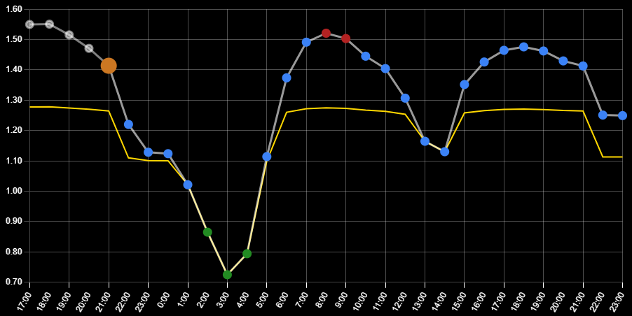
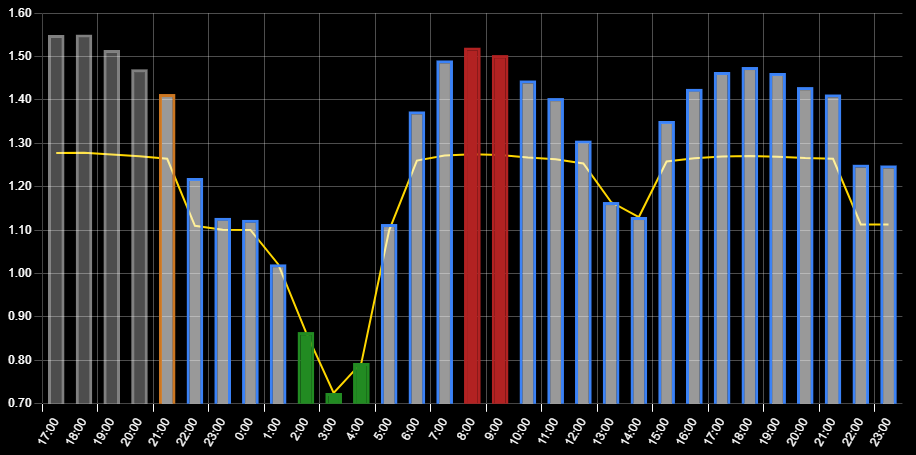
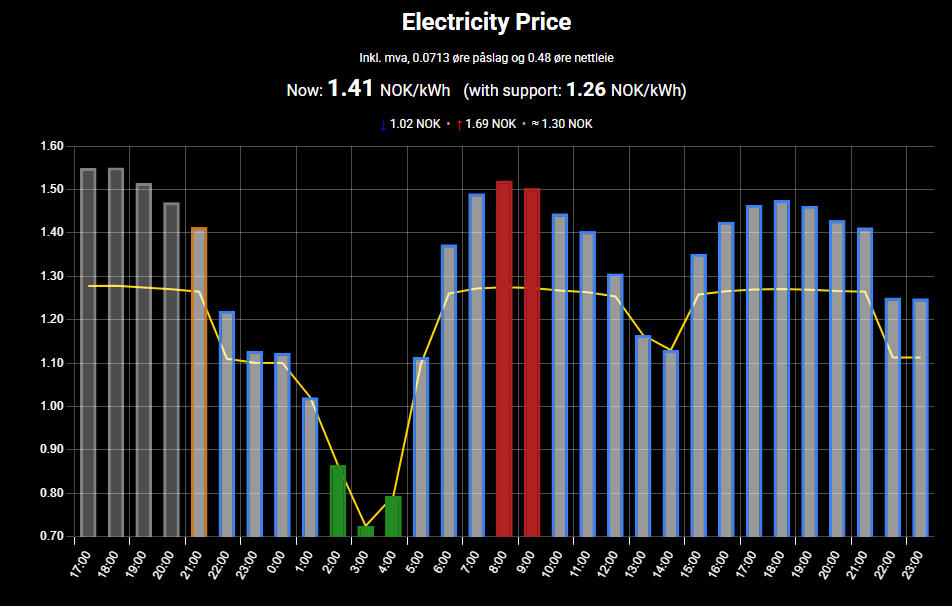

# MMM-EUElectricityPrice
🪄 Big thanks to **JanneKalliola** the original creator of this module. 
This version expands support to multiple EU/EEA regions and adds extensive customization and visual improvements.

A **MagicMirror²** module that shows **Nord Pool day-ahead electricity prices** for EU/EEA delivery areas. 
It fetches prices once at startup and again daily, then renders a bar or line chart with optional average line and visual highlights for cheap/expensive hours. 
Supports both hourly and 15-minute (quarter-hour) resolutions.

## Line chart

## Bar chart

## Chart with price

## Installation

Clone this repository in your modules folder, and install dependencies:

    cd ~/MagicMirror/modules 
    git clone https://github.com/late4marshmellow/MMM-EUElectricityPrice
    cd MMM-EUElectricityPrice
    npm install 

## Configuration

Go to the MagicMirror/config directory and edit the config.js file. Add the module to your modules array in your config.js.

Enter as minimimum these details in the config.js for your MagicMirror installation:
your dataSource is found here: https://data.nordpoolgroup.com/map?deliveryDate=latest&currency=EUR&market=DayAhead&mapDataType=Price&resolution=60

        {
            module: "MMM-EUElectricityPrice",
            position: "top_right",
            config: {
	    	headText: 'Electricity Price',
	    	dataSource: 'NO1', 
      	currency: 'NOK', 
		    chartType: 'bar', //can be 'bar' or 'line' (line looks good when module is placed in e.g 'bottom_center')
     
            }
        },

## Module configuration
The module has the following configuration options:

<table> <thead> <tr><th>Option</th><th>Default</th><th>Description</th></tr> </thead> <tbody>
<!-- Data source & units -->
<tr>
  <td><code>dataSource</code></td>
  <td><code>NO1</code></td>
  <td>Nord Pool delivery area (one of: <code>EE</code>, <code>LT</code>, <code>LV</code>, <code>AT</code>, <code>BE</code>, <code>FR</code>, <code>DE</code>, <code>NL</code>, <code>PL</code>, <code>DK1</code>, <code>DK2</code>, <code>FI</code>, <code>NO1</code>–<code>NO5</code>, <code>SE1</code>–<code>SE4</code>, <code>RO</code>, <code>BG</code>, <code>SYS</code>). Invalid values show an error.</td>
</tr>
<tr>
  <td><code>currency</code></td>
  <td><code>NOK</code></td>
  <td>Display currency (one of: <code>NOK</code>, <code>SEK</code>, <code>DKK</code>, <code>PLN</code>, <code>EUR</code>, <code>BGN</code>, <code>RON</code>). Invalid values show an error.</td>
</tr>
<tr>
  <td><code>centName</code></td>
  <td><code>øre</code></td>
  <td>Label for the sub-unit (e.g., “øre” for NOK, “cent” for EUR).</td>
</tr>
<tr>
  <td><code>displayInSubunit</code></td>
  <td><code>false</code></td>
  <td>If <code>true</code>, show prices in sub-unit per kWh (øre/cent). If <code>false</code>, show in main currency per kWh.</td>
</tr>

<!-- Header & info text -->
<tr>
  <td><code>headText</code></td>
  <td><code>Electricity Price</code></td>
  <td>Title shown above the chart. Set empty string to hide.</td>
</tr>
<tr>
  <td><code>customText</code></td>
  <td><code>""</code></td>
  <td>Optional subtitle under the title. Supports tags: <code>{{price}}</code>, <code>{{avg}}</code>, <code>{{low24}}</code>, <code>{{high24}}</code>, <code>{{date}}</code>, <code>{{time}}</code>, <code>{{currency}}</code>, <code>{{centName}}</code>, <code>{{area}}</code>, <code>{{gridEnergy}}</code>.</td>
</tr>
<tr>
  <td><code>showCurrency</code></td>
  <td><code>true</code></td>
  <td>Show the currency code next to the title.</td>
</tr>

<!-- Visibility toggles (info area) -->
<tr>
  <td><code>showNowLine</code></td>
  <td><code>true</code></td>
  <td>Show the “Now” line.</td>
</tr>
<tr>
  <td><code>currentPriceText</code></td>
  <td><code>Now: </code></td>
  <td>Label used for the current price line.</td>
</tr>
<tr>
  <td><code>showSupportInNow</code></td>
  <td><code>true</code></td>
  <td>Append strømstøtte price next to the “Now” value (when available).</td>
</tr>
<tr>
  <td><code>supportText</code></td>
  <td><code>with support: </code></td>
  <td>Label shown before the strømstøtte price in the “Now” line.</td>
</tr>
<tr>
  <td><code>showStatsLine</code></td>
  <td><code>true</code></td>
  <td>Show the low / high / average line.</td>
</tr>
<tr>
  <td><code>showLegend</code></td>
  <td><code>false</code></td>
  <td>Show the chart legend (useful when the support line is enabled).</td>
</tr>

<!-- Price calculation -->
<tr>
  <td><code>priceMultiplier</code></td>
  <td><code>1.25</code></td>
  <td>Multiply the raw energy component first (e.g., VAT 25% → <code>1.25</code>), then add <code>priceOffset</code>.</td>
</tr>
<tr>
  <td><code>priceOffset</code></td>
  <td><code>0</code></td>
  <td>Fixed add in main currency per kWh (e.g., <code>0.0713</code> for 7.13 cents).</td>
</tr>

<!-- Grid price rules -->
<tr>
  <td><code>gridPriceRules</code></td>
  <td>(see defaults)</td>
  <td>Time-of-day adders in sub-unit per kWh (local area time). Example: <code>[{from:'06:00',to:'22:00',add:47.66},{from:'22:00',to:'06:00',add:32.66}]</code></td>
</tr>

<!-- Strømstøtte (support) overlay -->
<tr>
  <td><code>showSupportLine</code></td>
  <td><code>false</code></td>
  <td>Draw a second line showing price after strømstøtte compensation.</td>
</tr>
<tr>
  <td><code>supportThreshold</code></td>
  <td><code>0.70</code></td>
  <td>Threshold (main currency/kWh). Energy above this may be compensated.</td>
</tr>
<tr>
  <td><code>supportPercent</code></td>
  <td><code>0.90</code></td>
  <td>Compensation fraction for the energy above threshold (e.g., <code>0.90</code> = 90%).</td>
</tr>
<tr>
  <td><code>supportColor</code></td>
  <td><code>#FFD700</code></td>
  <td>Chart color for the support line.</td>
</tr>
<tr>
  <td><code>supportLineWidth</code></td>
  <td><code>2</code></td>
  <td>Line width for the support line.</td>
</tr>

<!-- Time range & resolution -->
<tr>
  <td><code>resolution</code></td>
  <td><code>hour</code></td>
  <td><code>hour</code> = aggregate 15-min prices per hour; <code>quarter</code> = show 15-minute prices.</td>
</tr>
<tr>
  <td><code>showPastHours</code></td>
  <td><code>null</code></td>
  <td>Hours to show into the <em>past</em> (left). If <code>null</code>, derived from <code>totalHours</code>.</td>
</tr>
<tr>
  <td><code>showFutureHours</code></td>
  <td><code>36</code></td>
  <td>Hours to show into the <em>future</em> (right). In quarter mode, internally ×4.</td>
</tr>
<tr>
  <td><code>totalHours</code></td>
  <td><code>40</code></td>
  <td>Used to compute the window when <code>showPastHours</code> is <code>null</code>.</td>
</tr>
<tr>
  <td><code>hourOffset</code></td>
  <td><code>1</code></td>
  <td>Display offset from UTC for labeling (hours). Typically local offset for the area.</td>
</tr>

<!-- Size / position -->
<tr>
  <td><code>width</code></td>
  <td><code>null</code></td>
  <td>Wrapper width (CSS). If set, a translate is applied using <code>posRight</code>/<code>posDown</code>.</td>
</tr>
<tr>
  <td><code>height</code></td>
  <td><code>null</code></td>
  <td>Wrapper height (CSS).</td>
</tr>
<tr>
  <td><code>posRight</code></td>
  <td><code>null</code></td>
  <td>X-translate offset (CSS length) applied to the wrapper.</td>
</tr>
<tr>
  <td><code>posDown</code></td>
  <td><code>null</code></td>
  <td>Y-translate offset (CSS length) applied to the wrapper.</td>
</tr>

<!-- Chart appearance -->
<tr>
  <td><code>chartType</code></td>
  <td><code>bar</code></td>
  <td><code>bar</code> or <code>line</code>.</td>
</tr>
<tr>
  <td><code>showAverage</code></td>
  <td><code>true</code></td>
  <td>Draw an average line across the visible window.</td>
</tr>
<tr>
  <td><code>averageColor</code></td>
  <td><code>#fff</code></td>
  <td>Average line color.</td>
</tr>
<tr>
  <td><code>showGrid</code></td>
  <td><code>true</code></td>
  <td>Toggle grid lines.</td>
</tr>
<tr>
  <td><code>gridColor</code></td>
  <td><code>rgba(255, 255, 255, 0.3)</code></td>
  <td>Grid line color.</td>
</tr>
<tr>
  <td><code>labelColor</code></td>
  <td><code>#fff</code></td>
  <td>Axis label/tick color.</td>
</tr>

<!-- Colors / segments -->
<tr>
  <td><code>pastColor</code></td>
  <td><code>rgba(255, 255, 255, 0.5)</code></td>
  <td>Border color for past points/bars.</td>
</tr>
<tr>
  <td><code>pastBg</code></td>
  <td><code>rgba(255, 255, 255, 0.3)</code></td>
  <td>Fill for past bars.</td>
</tr>
<tr>
  <td><code>currentColor</code></td>
  <td><code>#CC7722</code></td>
  <td>Border color for the current slot.</td>
</tr>
<tr>
  <td><code>currentBg</code></td>
  <td><code>#CC7722</code></td>
  <td>Fill for the current slot (used when <code>currentbgSwitch</code> is <code>true</code>).</td>
</tr>
<tr>
  <td><code>normalColor</code></td>
  <td><code>#3b82f6</code></td>
  <td>Border color for normal future bars/points.</td>
</tr>
<tr>
  <td><code>futureColor</code></td>
  <td><code>rgba(255, 255, 255, 0.8)</code></td>
  <td>Border color for future bars/points.</td>
</tr>
<tr>
  <td><code>futureBg</code></td>
  <td><code>rgba(255, 255, 255, 0.6)</code></td>
  <td>Fill for future bars.</td>
</tr>
<tr>
  <td><code>currentbgSwitch</code></td>
  <td><code>false</code></td>
  <td>If <code>true</code>, current bar uses <code>currentBg</code>; else it uses <code>futureBg</code>.</td>
</tr>
<tr>
  <td><code>lineColor</code></td>
  <td><code>null</code></td>
  <td>If set, single color for the line (no segment coloring).</td>
</tr>
<tr>
  <td><code>pastLineColor</code></td>
  <td><code>rgba(255,255,255,0.5)</code></td>
  <td>Line color for past segments (when <code>lineColor</code> is <code>null</code>).</td>
</tr>
<tr>
  <td><code>futureLineColor</code></td>
  <td><code>rgba(255,255,255,0.6)</code></td>
  <td>Line color for future segments (when <code>lineColor</code> is <code>null</code>).</td>
</tr>

<!-- Alerts / Safe -->
<tr>
  <td><code>alertLimit</code></td>
  <td><code>false</code></td>
  <td>Enable high-price highlighting (values &gt; <code>alertValue</code>).</td>
</tr>
<tr>
  <td><code>alertValue</code></td>
  <td><code>100</code></td>
  <td>Threshold in the <em>display unit</em> (øre/cent per kWh if sub-unit mode; main currency per kWh otherwise). You can also use <code>"average"</code>.</td>
</tr>
<tr>
  <td><code>alertColor</code></td>
  <td><code>#B22222</code></td>
  <td>Border color for high values.</td>
</tr>
<tr>
  <td><code>alertBg</code></td>
  <td><code>#B22222</code></td>
  <td>Fill color for high values (bar charts).</td>
</tr>
<tr>
  <td><code>safeLimit</code></td>
  <td><code>false</code></td>
  <td>Enable low-price highlighting (values &lt; <code>safeValue</code>).</td>
</tr>
<tr>
  <td><code>safeValue</code></td>
  <td><code>50</code></td>
  <td>Threshold in the display unit (same rules as <code>alertValue</code>). You can also use <code>"average"</code>.</td>
</tr>
<tr>
  <td><code>safeColor</code></td>
  <td><code>#228B22</code></td>
  <td>Border color for low values.</td>
</tr>
<tr>
  <td><code>safeBg</code></td>
  <td><code>#228B22</code></td>
  <td>Fill color for low values (bar charts).</td>
</tr>

<!-- Scales / formatting -->
<tr>
  <td><code>beginAtZero</code></td>
  <td><code>true</code></td>
  <td>Start Y-axis at zero.</td>
</tr>
<tr>
  <td><code>yDecimals</code></td>
  <td><code>2</code></td>
  <td>Decimals on the Y-axis.</td>
</tr>

<!-- Line-only sizing -->
<tr>
  <td><code>borderWidthLine</code></td>
  <td><code>3</code></td>
  <td>Line width (line charts).</td>
</tr>
<tr>
  <td><code>pointRegular</code></td>
  <td><code>4</code></td>
  <td>Point radius for full-hour ticks (line charts).</td>
</tr>
<tr>
  <td><code>pointCurrent</code></td>
  <td><code>10</code></td>
  <td>Point radius for current slot (line charts).</td>
</tr>
<tr>
  <td><code>pointQuarter</code></td>
  <td><code>2</code></td>
  <td>Point radius for quarter-hour ticks (line charts).</td>
</tr>

<!-- Bar-only -->
<tr>
  <td><code>borderWidthBar</code></td>
  <td><code>1</code></td>
  <td>Bar border width (bar charts).</td>
</tr>

<!-- X-axis labels / ticks -->
<tr>
  <td><code>xLabelDiagonal</code></td>
  <td><code>true</code></td>
  <td>Rotate X-axis labels diagonally.</td>
</tr>
<tr>
  <td><code>xLabelAngle</code></td>
  <td><code>60</code></td>
  <td>Angle (degrees) for diagonal X-labels.</td>
</tr>
<tr>
  <td><code>xLabelPadding</code></td>
  <td><code>4</code></td>
  <td>Padding around X-axis labels.</td>
</tr>
<tr>
  <td><code>xAutoSkip</code></td>
  <td><code>false</code></td>
  <td>Let Chart.js auto-thin X labels when needed.</td>
</tr>
<tr>
  <td><code>xMaxTicks</code></td>
  <td><code>null</code></td>
  <td>Limit the number of X-ticks (leave <code>null</code> to auto).</td>
</tr>
<tr>
  <td><code>xLabelEveryHours</code></td>
  <td><code>1</code></td>
  <td>Render a label every N hours (quarter mode labels only at full hours).</td>
</tr>

<!-- Misc / updates -->
<tr>
  <td><code>tickInterval</code></td>
  <td><code>false</code></td>
  <td><em>Legacy</em>. Kept for compatibility.</td>
</tr>
<tr>
  <td><code>updateUIInterval</code></td>
  <td><code>300</code></td>
  <td>Redraw interval in seconds (does not refetch; updates highlight/ticks).</td>
</tr>
<tr>
  <td><code>tomorrowDataTime</code></td>
  <td><code>false</code></td>
  <td>If a number (0–23), fetch tomorrow’s prices at that local hour (uses <code>tomorrowDataTimeMinute</code>). If <code>false</code>, poll around Nord Pool publish time <strong>13:00 Europe/Oslo</strong>.</td>
</tr>
<tr>
  <td><code>tomorrowDataTimeMinute</code></td>
  <td><code>1</code></td>
  <td>Minute within the hour for manual fetch scheduling.</td>
</tr>
<tr>
  <td><code>errorMessage</code></td>
  <td><code>Data could not be fetched.</code></td>
  <td>Shown when data cannot be retrieved/parsed.</td>
</tr>
<tr>
  <td><code>loadingMessage</code></td>
  <td><code>Loading data...</code></td>
  <td>Shown while awaiting data.</td>
</tr>
</tbody> </table>

## Changelog

**2024-10-16** Updated to fit new Nordpool API, error message on screen when wrong datasource or currency is entered.

**2022-09-04** Initial version

**2025-10-05** Updatetd to fit new 15-min intervall, updated chart.js to v4 for new installs, fallback to v3 for pull requests
added a switch between quarter and hourly pricing on chart. 
