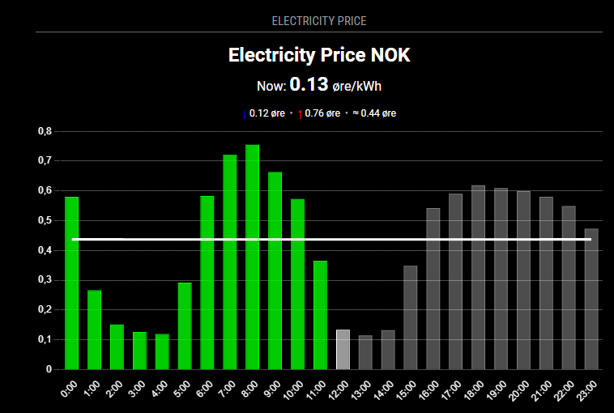
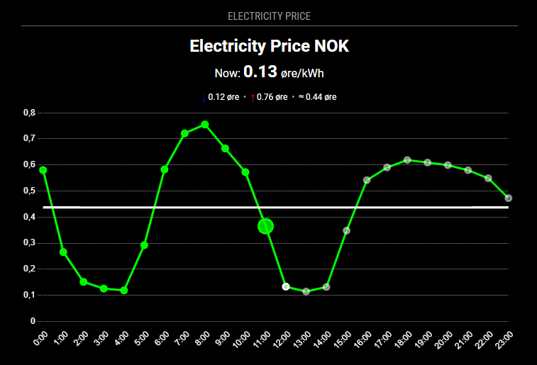

# MMM-EUElectricityPrice
🪄 Big thanks to **JanneKalliola** the original creator of this module. 
This version expands support to multiple EU/EEA regions and adds extensive customization and visual improvements.

A **MagicMirror²** module that shows **Nord Pool day-ahead electricity prices** for EU/EEA delivery areas. 
It fetches prices once at startup and again daily, then renders a bar or line chart with optional average line and visual highlights for cheap/expensive hours. 
Supports both hourly and 15-minute (quarter-hour) resolutions.

## Bar chart

## Line chart

## Installation

Clone this repository in your modules folder, and install dependencies:

    cd ~/MagicMirror/modules 
    git clone https://github.com/late4marshmellow/MMM-EUElectricityPrice
    cd MMM-EUElectricityPrice
    npm install 

## Configuration

Go to the MagicMirror/config directory and edit the config.js file. Add the module to your modules array in your config.js.

Enter as minimimum these details in the config.js for your MagicMirror installation:
your dataSource is found here: https://data.nordpoolgroup.com/map?deliveryDate=latest&currency=EUR&market=DayAhead&mapDataType=Price&resolution=60

        {
            module: "MMM-EUElectricityPrice",
            position: "top_right",
            config: {
	    	headText: 'Electricity Price',
	    	dataSource: 'NO1', 
      	currency: 'NOK', 
		    chartType: 'bar', //can be 'bar' or 'line' (line looks good when module is placed in e.g 'bottom_center')
     
            }
        },

## Module configuration
The module has the following configuration options:

<table> <thead> <tr> <th>Option</th> <th>Default</th> <th>Description</th> </tr> </thead> <tbody>
<tr>
  <td><code>dataSource</code></td>
  <td><code>NO1</code></td>
  <td>Nord Pool delivery area (one of: <code>EE</code>, <code>LT</code>, <code>LV</code>, <code>AT</code>, <code>BE</code>, <code>FR</code>, <code>GER</code>, <code>NL</code>, <code>PL</code>, <code>DK1</code>, <code>DK2</code>, <code>FI</code>, <code>NO1</code>–<code>NO5</code>, <code>SE1</code>–<code>SE4</code>, <code>SYS</code>). The module validates this value and shows an error if it’s not allowed.</td>
</tr>

<tr>
  <td><code>currency</code></td>
  <td><code>NOK</code></td>
  <td>Display currency (one of: <code>NOK</code>, <code>SEK</code>, <code>DKK</code>, <code>PLN</code>, <code>EUR</code>). Invalid values trigger a visible error.</td>
</tr>

<tr>
  <td><code>centName</code></td>
  <td><code>øre</code></td>
  <td>Unit label shown on the chart (e.g., <em>øre</em> for NOK cents).</td>
</tr>

<tr>
  <td><code>headText</code></td>
  <td><code>Electricity Price</code></td>
  <td>Title shown above the chart.</td>
</tr>

<tr>
  <td><code>customText</code></td>
  <td><code>""</code></td>
  <td>Optional small subtitle under the title.</td>
</tr>

<tr>
  <td><code>showCurrency</code></td>
  <td><code>true</code></td>
  <td>Show the currency next to the title.</td>
</tr>

<tr>
  <td><code>tomorrowDataTime</code></td>
  <td><code>13</code></td>
  <td>
    Controls when to pull tomorrow’s prices: 
    • If a <em>number</em> (0–23), fetch at that local hour (uses <code>tomorrowDataTimeMinute</code> for minutes). 
    • If <code>false</code>, use hardened Nord Pool publish time <strong>13:00 Europe/Oslo</strong> regardless of device timezone.
  </td>
</tr>

<tr>
  <td><code>tomorrowDataTimeMinute</code></td>
  <td><code>1</code></td>
  <td>Minute part for the manual schedule. Ignored when <code>tomorrowDataTime</code> is <code>false</code>.</td>
</tr>

<tr>
  <td><code>errorMessage</code></td>
  <td><code>Data could not be fetched.</code></td>
  <td>Shown when a fetch or parse error occurs.</td>
</tr>

<tr>
  <td><code>loadingMessage</code></td>
  <td><code>Loading data...</code></td>
  <td>Shown while fetching data.</td>
</tr>

<tr>
  <td><code>showPastHours</code></td>
  <td><code>null</code></td>
  <td>How many hours <em>after</em> the current slot to show (in the chart’s right side). If <code>null</code>, it is derived from <code>totalHours</code>.</td>
</tr>

<tr>
  <td><code>showFutureHours</code></td>
  <td><code>36</code></td>
  <td>How many hours <em>before</em> the current slot to include (left side). In quarter mode the code internally multiplies by 4.</td>
</tr>

<tr>
  <td><code>totalHours</code></td>
  <td><code>40</code></td>
  <td>If <code>showPastHours</code> is <code>null</code>, this is used to compute the total visible window.</td>
</tr>

<tr>
  <td><code>hourOffset</code></td>
  <td><code>1</code></td>
  <td>Offset from CET/CEST to local display time (e.g., <code>1</code> for FI/Baltics, <code>0</code> for CET/CEST, <code>-1</code> for GMT).</td>
</tr>

<tr>
  <td><code>priceOffset</code></td>
  <td><code>0</code></td>
  <td>Add a fixed surcharge (same currency). Applied <em>after</em> <code>priceMultiplier</code>. Example: <code>0.5713</code> NOK adds 57.13 øre/kWh.</td>
</tr>

<tr>
  <td><code>priceMultiplier</code></td>
  <td><code>1</code></td>
  <td>Multiply the base price first (e.g., VAT 25% → <code>1.25</code>), then add <code>priceOffset</code>.</td>
</tr>

<!-- Size / position -->
<tr>
  <td><code>width</code></td>
  <td><code>null</code></td>
  <td>Wrapper width (CSS value, e.g., <code>320px</code>, <code>20rem</code>). If set, a translate transform is applied using <code>posRight</code>/<code>posDown</code>.</td>
</tr>

<tr>
  <td><code>height</code></td>
  <td><code>null</code></td>
  <td>Wrapper height (CSS value).</td>
</tr>

<tr>
  <td><code>posRight</code></td>
  <td><code>null</code></td>
  <td>X-translate offset (CSS length) applied to the wrapper.</td>
</tr>

<tr>
  <td><code>posDown</code></td>
  <td><code>null</code></td>
  <td>Y-translate offset (CSS length) applied to the wrapper.</td>
</tr>

<!-- Chart -->
<tr>
  <td><code>chartType</code></td>
  <td><code>bar</code></td>
  <td><code>bar</code> or <code>line</code>.</td>
</tr>

<tr>
  <td><code>showAverage</code></td>
  <td><code>true</code></td>
  <td>Draw an average line across the currently displayed window.</td>
</tr>

<tr>
  <td><code>averageColor</code></td>
  <td><code>#fff</code></td>
  <td>Color for the average line (hex/rgba).</td>
</tr>

<tr>
  <td><code>showGrid</code></td>
  <td><code>true</code></td>
  <td>Toggle grid lines (both axes).</td>
</tr>

<tr>
  <td><code>gridColor</code></td>
  <td><code>rgba(255, 255, 255, 0.3)</code></td>
  <td>Grid line color.</td>
</tr>

<tr>
  <td><code>labelColor</code></td>
  <td><code>#fff</code></td>
  <td>Axis label/tick color.</td>
</tr>

<tr>
  <td><code>pastColor</code></td>
  <td><code>rgba(255, 255, 255, 0.5)</code></td>
  <td>Border color for past bars/points.</td>
</tr>

<tr>
  <td><code>pastBg</code></td>
  <td><code>rgba(255, 255, 255, 0.3)</code></td>
  <td>Fill for past bars.</td>
</tr>

<tr>
  <td><code>currentColor</code></td>
  <td><code>#fff</code></td>
  <td>Border color for the current slot.</td>
</tr>

<tr>
  <td><code>currentBg</code></td>
  <td><code>#fff</code></td>
  <td>Fill for the current slot (used when <code>currentbgSwitch</code> is <code>true</code>).</td>
</tr>

<tr>
  <td><code>currentbgSwitch</code></td>
  <td><code>false</code></td>
  <td>If <code>true</code>, the current slot uses <code>currentBg</code>; if <code>false</code>, it uses <code>futureBg</code> for a subtler look.</td>
</tr>

<tr>
  <td><code>futureColor</code></td>
  <td><code>rgba(255, 255, 255, 0.8)</code></td>
  <td>Border color for future bars/points.</td>
</tr>

<tr>
  <td><code>futureBg</code></td>
  <td><code>rgba(255, 255, 255, 0.6)</code></td>
  <td>Fill for future bars.</td>
</tr>

<!-- Alerts / Safe -->
<tr>
  <td><code>alertLimit</code></td>
  <td><code>false</code></td>
  <td>Enable expensive-hour highlighting. When <code>true</code>, values above <code>alertValue</code> are colored (<code>alertColor</code>/<code>alertBg</code>).</td>
</tr>

<tr>
  <td><code>alertValue</code></td>
  <td><code>100</code></td>
  <td>Threshold in <em><code>centName</code> per kWh</em> (e.g., 100 = 100&nbsp;øre/kWh). You can also use the string <code>"average"</code> to highlight hours above the current window’s average.</td>
</tr>

<tr>
  <td><code>alertColor</code></td>
  <td><code>rgba(255, 0, 0, 1)</code></td>
  <td>Border color for expensive hours.</td>
</tr>

<tr>
  <td><code>alertBg</code></td>
  <td><code>rgba(255, 0, 0, 0.8)</code></td>
  <td>Fill color for expensive hours.</td>
</tr>

<tr>
  <td><code>safeLimit</code></td>
  <td><code>false</code></td>
  <td>Enable cheap-hour highlighting. When <code>true</code>, values below <code>safeValue</code> are colored (<code>safeColor</code>/<code>safeBg</code>).</td>
</tr>

<tr>
  <td><code>safeValue</code></td>
  <td><code>50</code></td>
  <td>Threshold in <em><code>centName</code> per kWh</em> (e.g., 50 = 50&nbsp;øre/kWh). You can also use <code>"average"</code> to mark hours below the current window’s average.</td>
</tr>

<tr>
  <td><code>safeColor</code></td>
  <td><code>rgba(0, 255, 0, 1)</code></td>
  <td>Border color for cheap hours.</td>
</tr>

<tr>
  <td><code>safeBg</code></td>
  <td><code>rgba(0, 255, 0, 0.8)</code></td>
  <td>Fill color for cheap hours.</td>
</tr>

<!-- Scales / formatting -->
<tr>
  <td><code>beginAtZero</code></td>
  <td><code>true</code></td>
  <td>Y-axis starts at zero.</td>
</tr>

<tr>
  <td><code>yDecimals</code></td>
  <td><code>2</code></td>
  <td>Number of decimals shown on the Y-axis.</td>
</tr>

<!-- Line-only -->
<tr>
  <td><code>borderWidthLine</code></td>
  <td><code>3</code></td>
  <td>Line width for line charts.</td>
</tr>

<tr>
  <td><code>pointRegular</code></td>
  <td><code>4</code></td>
  <td>Point radius for full-hour nodes in line charts.</td>
</tr>

<tr>
  <td><code>pointCurrent</code></td>
  <td><code>10</code></td>
  <td>Point radius for the current slot in line charts.</td>
</tr>

<tr>
  <td><code>pointQuarter</code></td>
  <td><code>2</code></td>
  <td>Point radius for quarter-hour nodes in line charts.</td>
</tr>

<!-- Bar-only -->
<tr>
  <td><code>borderWidthBar</code></td>
  <td><code>1</code></td>
  <td>Bar border width for bar charts.</td>
</tr>

<!-- X axis labels / ticks -->
<tr>
  <td><code>xLabelDiagonal</code></td>
  <td><code>true</code></td>
  <td>Rotate X-axis labels diagonally.</td>
</tr>

<tr>
  <td><code>xLabelAngle</code></td>
  <td><code>60</code></td>
  <td>Angle (degrees) for diagonal labels.</td>
</tr>

<tr>
  <td><code>xLabelPadding</code></td>
  <td><code>4</code></td>
  <td>Padding around X-axis labels.</td>
</tr>

<tr>
  <td><code>xAutoSkip</code></td>
  <td><code>false</code></td>
  <td>Let Chart.js auto-thin X labels when needed.</td>
</tr>

<tr>
  <td><code>xMaxTicks</code></td>
  <td><code>null</code></td>
  <td>Cap the number of X-axis ticks (leave <code>null</code> to let Chart.js decide).</td>
</tr>

<tr>
  <td><code>xLabelEveryHours</code></td>
  <td><code>1</code></td>
  <td>Render a label every N hours (applies in both <code>hour</code> and <code>quarter</code> modes; quarter mode still only labels full hours).</td>
</tr>

<!-- Misc -->
<tr>
  <td><code>tickInterval</code></td>
  <td><code>false</code></td>
  <td><em>Legacy</em> (kept for compatibility). X-axis labeling is now controlled by the <code>x*</code> options above.</td>
</tr>

<tr>
  <td><code>updateUIInterval</code></td>
  <td><code>300</code></td>
  <td>Redraw interval in seconds (does not refetch; updates the current-time highlight and chart).</td>
</tr>

<tr>
  <td><code>resolution</code></td>
  <td><code>hour</code></td>
  <td><code>hour</code> = aggregate 15-min prices per hour; <code>quarter</code> = show 15-minute prices and mini points on the line chart.</td>
</tr>
</tbody> </table>

## Changelog

**2024-10-16** Updated to fit new Nordpool API, error message on screen when wrong datasource or currency is entered.

**2022-09-04** Initial version

**2025-10-05** Updatetd to fit new 15-min intervall, updated chart.js to v4 for new installs, fallback to v3 for pull requests
added a switch between quarter and hourly pricing on chart. 
